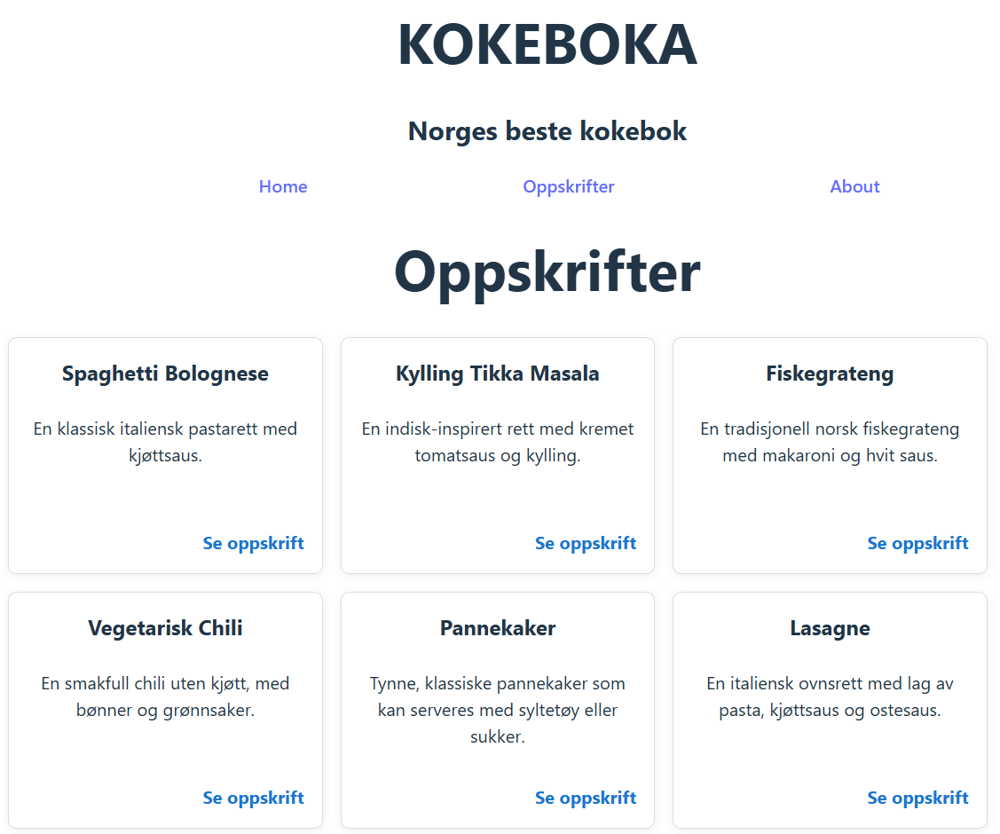

# Lage et Card-komponent i React

Ta utgangspunkt i Kokebok-nettsida. Du skal en komponent kalt Card for å vise fram oppskrifer i kortformat på /oppskrifter-nettsiden.
Det skal se ut omtrent som på dette bildet (du kan selvfølgelig bestemme farger, skrifttyper, størrelse på elementer osv selv):

Du kan bruke koden som ligger i mappen _kokeboka_ hvis du ikke har fungerende kode selv.
